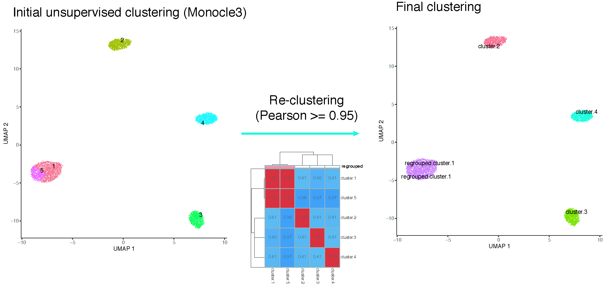
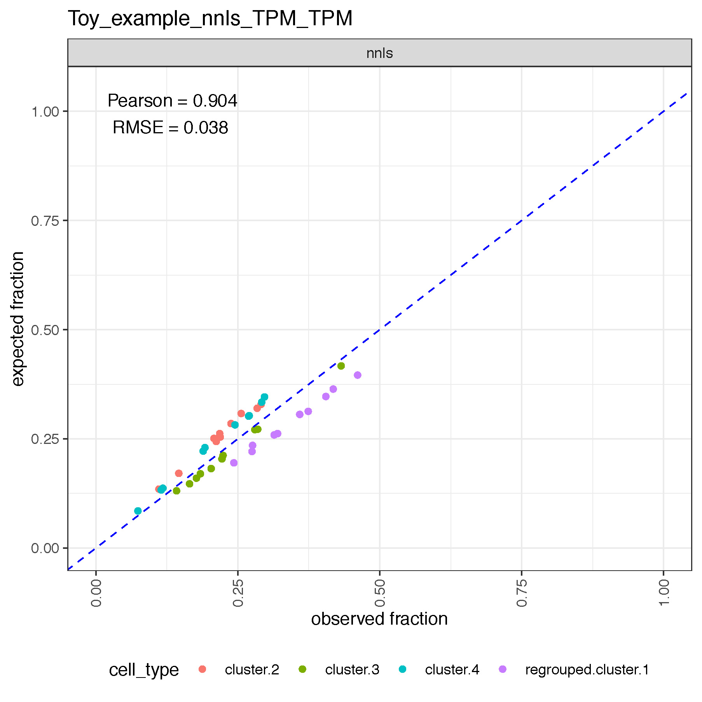

Source code (R statistical programming language, v4.0.1) to reproduce the results described in the article:

> *Avila Cobos F...* **Effective methods for bulk RNA-seq deconvolution using scRNA-seq and snRNA-seq derived transcriptomes** *(bioRxiv; https://doi.org/...)*

DATASETS
========
Here we provide an **example folder** (named "Toy_example"; see *"Folder requirements" & "Running the deconvolution"*) that can be directly used to test the framework. It contains an artificial single-cell RNA-seq dataset made of 5 artificial cell types where two of them are highly correlated (cell type 1 and 5); 1000 cells per cell type and 64 genes (of which 16 are marker genes, 4 per cell type and in different ranges of expression).

The **other external datasets used in the manuscript** (together with the necessary metadata) can be downloaded from their respective sources:

* Cell_mixtures:
* GSE141115: https://www.ncbi.nlm.nih.gov/geo/download/?acc=GSE141115&format=file ; additional sample metadata information in "additional_data/Denisenko_crosstable_bulk_sc_sn_14092021".
* AML:
* Breast_cancer: GSE176078 ("GSE176078_RAW.tar" from "https://www.ncbi.nlm.nih.gov/geo/download/?acc=GSE176078&format=file")
* NB_1:
* NB_2:
* Synapse: syn8691134; syn23554292; syn23554293; syn23554294
* Brain: GSE67835 ("GSE67835_RAW.tar" from https://www.ncbi.nlm.nih.gov/geo/download/?acc=GSE67835&format=file) & IHC proportions (re-scaled to sum-to-one) present here: https://github.com/ellispatrick/CortexCellDeconv/tree/master/CellTypeDeconvAnalysis/Data [IHC.astro.txt, IHC.endo.txt, IHC.microglia.txt, IHC.neuro.txt; IHC.oligo.txt]


The following line is needed for fresh installations of Linux (Debian):
`sudo apt-get install curl libcurl4-openssl-dev libssl-dev zlib1g-dev r-base-dev libxml2-dev`


R 4.0.1: REQUIRED PACKAGES AND PACKAGE DEPENDENCIES:
===================================================
Packages to be installed (alphabetically ordered) before running any deconvolution (**R >= 4.0.1**):
```

AnnotationDbi
Biobase
CIBERSORT
data.table
devtools
doMC
dplyr
edgeR
egg
foreach
FARDEEP
ggplot2
ggpointdensity
ggpubr
ggrastr
ggrepel
gridExtra
gtools
limma
MASS
Matrix
matrixStats
monocle3
MuSiC
nnls
org.Hs.eg.db
org.Mm.eg.db
parallel
pheatmap
RColorBrewer
R.utils
scater
scran
sctransform
Seurat
SingleCellExperiment
tidyr
tidyverse
viridis

```


References to other methods included in our benchmark:
======================================================
While our work has a **BSD (3-clause)** license, you **may need** to obtain a license to use the individual normalization/deconvolution methods (e.g. CIBERSORT. The source code for CIBERSORT needs to be asked to the authors at https://cibersort.stanford.edu).

| method | ref |
|--------|----------|
| nnls | Mullen, K. M. & van Stokkum, I. H. M. nnls: The Lawson-Hanson algorithm for non-negative least squares (NNLS). R package version 1.4. https://CRAN.R-project.org/package=nnls |
| FARDEEP | Hao, Y., Yan, M., Lei, Y. L. & Xie, Y. Fast and Robust Deconvolution of Tumor Infiltrating Lymphocyte from Expression Profiles using Least Trimmed Squares. bioRxiv 358366 (2018) doi:10.1101/358366 |
| MASS: Robust linear regression (RLR) | Ripley, B. et al. MASS: Support Functions and Datasets for Venables and Ripley’s MASS. (2002) |
| CIBERSORT | Newman, A. M. et al. Robust enumeration of cell subsets from tissue expression profiles. Nat. Methods 12, 453–457 (2015) |
|--------|----------|
| DWLS | Tsoucas, D. et al. Accurate estimation of cell-type composition from gene expression data. Nat. Commun. 10, 1–9 (2019) |
| MuSiC | Wang, X., Park, J., Susztak, K., Zhang, N. R. & Li, M. Bulk tissue cell type deconvolution with multi-subject single-cell expression reference. Nat. Commun. 10, 380 (2019) |
|--------|----------|
| SCTransform / regularized negative binomial regression (RNBR) | Hafemeister, C. & Satija, R. Normalization and variance stabilization of single-cell RNA-seq data using regularized negative binomial regression. Genome Biology (2019) doi:10.1186/s13059-019-1874-1 |
|scran | L. Lun, A. T., Bach, K. & Marioni, J. C. Pooling across cells to normalize single-cell RNA sequencing data with many zero counts. Genome Biol. 17, 75 (2016) |
| scater | McCarthy, D. J., Campbell, K. R., Lun, A. T. L. & Wills, Q. F. Scater: pre-processing, quality control, normalization and visualization of single-cell RNA-seq data in R. Bioinformatics 33, 1179–1186 (2017) |
| Trimmed mean of M-values (TMM) | Robinson, M. D. & Oshlack, A. A scaling normalization method for differential expression analysis of RNA-seq data. Genome Biol. 11, R25 (2010) |
| Transcripts per million (TPM) | Li, B., Ruotti, V., Stewart, R. M., Thomson, J. A. & Dewey, C. N. RNA-Seq gene expression estimation with read mapping uncertainty. Bioinformatics 26, 493–500 (2010) |
| LogNormalize | LogNormalize function (part of "Seurat"). R Documentation. https://www.rdocumentation.org/packages/Seurat/versions/3.1.1/topics/LogNormalize ; Butler, A., Hoffman, P., Smibert, P. et al. Integrating single-cell transcriptomic data across different conditions, technologies, and species. Nat Biotechnol 36, 411–420 (2018) doi:10.1038/nbt.4096 |


FOLDER REQUIREMENTS
===================

a) Folder structure:

**NOTE**: The gold standard matrix of proportions ("P") is either present or obtained as the sum of individual cells across each cell type.


```
.
├── AML
│   ├── scC.rds
│   ├── T.rds
│   ├── phenoDataC_clusters_wo_regrouping.txt
├── Brain
│   ├── scC.rds
│   ├── T.rds
│   ├── P.rds (from IHC)
│   ├── phenoDataC_clusters_wo_regrouping.txt
├── Toy_example
│   ├── scC.rds
│   ├── T.rds
│   ├── P.rds
│   ├── phenoDataC_clusters_wo_regrouping.txt
│   └── markers_TMM_FC1.5_Seuratwilcox.rds (if not present will be created)
... 
│
├── helper_functions.R
├── MASTER.R
└── CIBERSORT.R
```

b) Minimally the following (tab-separated) columns being part of the metadata: "cellID", "cellType", "SubjectName". 

```
# For the "example" dataset, it should look like:

cellID		cellType	SubjectName
cell_1	 cell_type_1		  Mix_1
cell_2	 cell_type_1		  Mix_2
...
```


RUNNING THE DECONVOLUTION
=========================
The deconvolution problem is formulated as: T = C·P [see https://doi.org/10.1093/bioinformatics/bty019 and https://doi.org/10.1038/s41467-020-19015-1 for detailed information]

Make the following choices (in order):

```
	i) specific dataset [from: "example","Cell_mixtures", "GSE141115", "AML", "Breast_cancer", "NB_1", "NB_2", "Synapse", "Brain"]
	ii) normalization strategy for the reference matrix [bulk (C): "none", "LogNormalize", "TMM", "TPM"] ; [single-cell: "none", "LogNormalize", "TMM", "TPM", "SCTransform", "scran", "scater"]
	iii) normalization strategy for the mixture matrix (T)["none", "LogNormalize", "TMM", "TPM"]
	iv) deconvolution method [from: "CIBERSORT", "nnls", "FARDEEP", "RLR", "MuSiC", "MuSiC_with_markers", "DWLS", "Janus"]
	v) indicate whether cell-type labels are included ("yes") or whether they should be obtained by unsupervised clustering ("no")
```

R example call
===============

**NOTE**: Each single-cell RNA-seq dataset ("scC.rds") and mixture ("T.rds") should be **RAW integer MATRICES** containing genomic features as rows.

```

Rscript MASTER.R ~/Downloads/deconv_matching_bulk_scnRNA/Toy_example TPM TPM nnls no

```

In the "example" (toy) dataset cell types 1 and 5 were found to be very highly correlated and were first collapsed into a unique cluster (relabelled as "regrouped.cluster.1"):



Next, the deconvolution was run and the output was generated:




Survival analysis
=================
Please run sript(s) inside folder "SURVIVAL"
